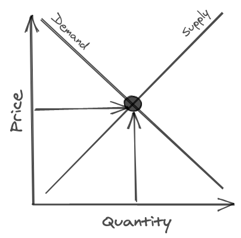
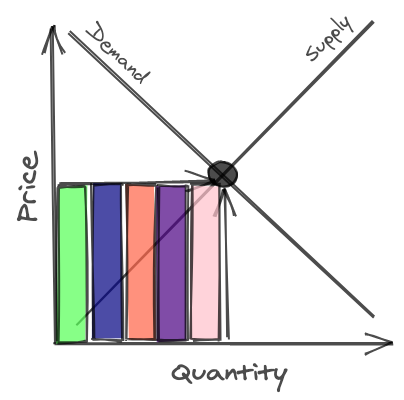
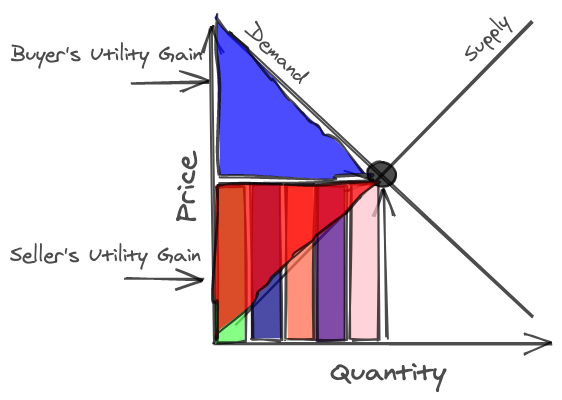
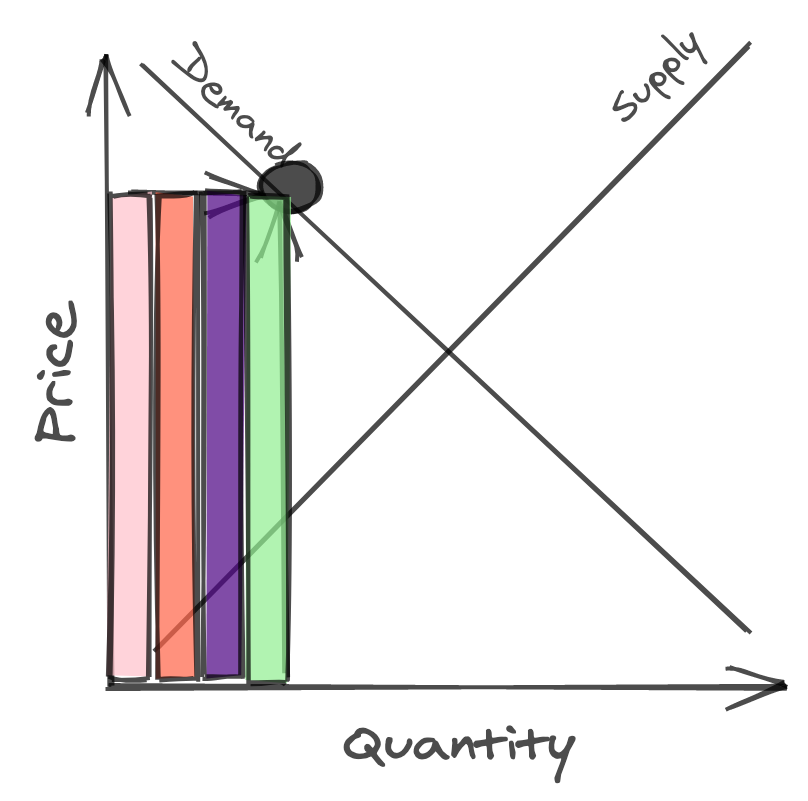
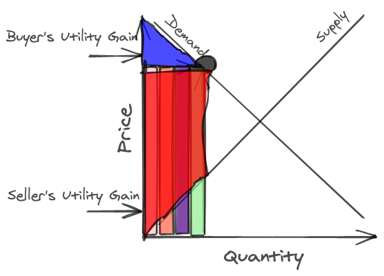

In `Zero to One`, Peter Thiel proclaims "Competition is for losers." -- if you can make a monopoly, you should, because you can extract far more profit from it than if you participated in an open market.

In a free market, with perfect competition, you face this supply and demand curve below. You have to sell the good at the price where supply meets demand, and you can sell up to but not more than quantity where demand meets supply. Assuming you're not the only seller of the good, you have to settle for some chunk of the market.

Assume there are 5 merchants, and the amount of revenue you can bring in is the square created by the area of where supply meets demand, you get something like this:

All of you split the market somewhat equally, and you make 0 _economic_ profit. Nobody can sell the good for more than it's worth (opportunity cost + cost of production), and nobody will buy the good for more than it's worth (opportunity cost + cost of production). The perfectly free market makes buyers and sellers equally well off.

This assumes that the first few products that a firm sells on the open market are the _cheapest_ for it to produce, and that there are buyers that are willing to pay _more_ for the product than others, because it is inherently worth more to them. The firms get to sell the goods that cost less for them to make at a higher price, and the buyers who would've bought the good at a higher price to get to pay less for the good. Everyone wins a little bit.

But firms want to make _economic_ profit. This is where the real money comes in. You can do this in many ways; organizations like OPEC (the Organization of the Petroleum Exporting Countries) band together every year and restrict the supply of oil on the open market. This lets them charge more for their good (oil), since artificial scarcity drives up the price of oil.

Because of this, the market for oil looks something like this:

The utility that both sides get is:

Nice! We've made _economic_ profit. What we've done here is taken a large slice of the pie for ourselves; the buyers lose some utility, but in exchange the sellers get more utility. However, we've lost some _total_ utility. The area to the right of the seller's utility gain is now white. That's utility that we've _lost_. This is called _Deadweight Loss_, because OPEC has now made some utility inherent to the market unreachable. The market as a whole could be better off and capture that white area if OPEC decided to sell oil at the market competitive price.

OPEC made the market better for the sellers, in exchange for hurting the buyers, and worse for the economy as a whole.

In this case, OPEC is an oligopoly, or a case where there are only a few sellers of a good. A monopoly is when there's only one, and a duopoly is when there are only two. All of these traditionally generate deadweight loss, generating less utility for the buyer and more for the seller(s). This is why you hear how monopolies and oligopolies are _bad_ and should be broken up by the government.

But OPEC isn't a maintainable oligopoly. Saudi Arabia doesn't trust the other members of OPEC. Russia doesn't trust OPEC. In fact, OPEC doesn't trust itself. The reason is simple: As a seller, you could make more money if you undercut the market and sell more oil at a lower price. If I sell oil at a lower price than the other countries, I get all of the profits. That entire red rhombus I had to share with the other sellers? All mine. And I expand it a little bit too. The rhombus gets fatter for me, at the expense of all of the other sellers. Oligopolies have a cooperation problem -- the economy cannot enforce its sellers to sell a good at a higher price than it values said good. So Russia, Venezuela, Saudi, and so forth go to each OPEC meeting wondering if this is the time the other countries backstab them and make off with all the gold. In OPEC's case, all of the countries have to be well armed too, because they don't know when the other countries might come to capture their oil to increase their profits. Cooperation works worst when all parties are paranoid.

The problem with this model of economics is that it only somewhat applies to some goods in some places. This assumes we have symmetric information -- that sellers know just as much as buyers. This also assumes that our goods are private and no different than each other. But really, every good is somewhat different; coke isn't exactly the same as pepsi, even though they are similar products. This model also doesn't count network effects, where making a good become more popular has benefits to all of its users and its overall utility.

If I wanted to buy some British soda, I would have to import that soda to the US in order to buy it. That costs me both time and money; and so the soda costs more than it would if I simply wanted a coke. If I wanted a coke, I could just walk down the street since every grocery store carries it, because of its popularity. Coke is cheaper than this British soda, Iron Bru.

A service like Uber really wants a monopoly for that reason; because if it had a monopoly, it would be able to have all of the drivers on its platform available to serve all of the riders, and thus be able to get economic profit. Alas, Lyft exists; and so, there are only half the available drivers on Uber and half the available riders on Uber. Uber and Lyft are then also forced to price their service lower and lower to beat each other out and win the loyalty of their riders. Buyers win here, but the sellers are engaged in a race to the bottom. And only one will survive, a la highlander.

If we assume that a monopoly is the only way to go to gain monopolistic profits, we need to find a way to do so, without using force (because that breeds paranoia). The only way out is by making a better product. If we make a better product, we can create a market that didn't exist before, and gain monopolistic profits from that market. If this product cannot be replicated, then there is no incentive to stop the monopoly; because the market will only be worse off. Thus, no use of force in any way can stop us from gaining monopoly profits. But building the next Google is hard. Incredibly so.

You can, however, build a product that has differentiation in some way. You must have a feature that is _hard_ and _useful_, and you too can ride a smaller but also profitable monopoly curve for profit.
