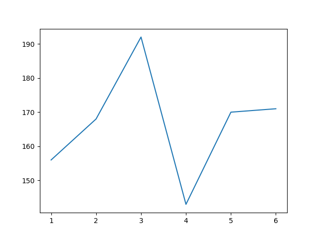
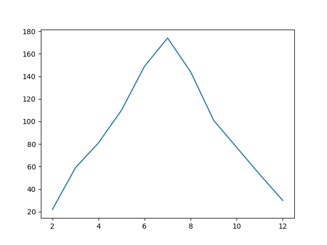
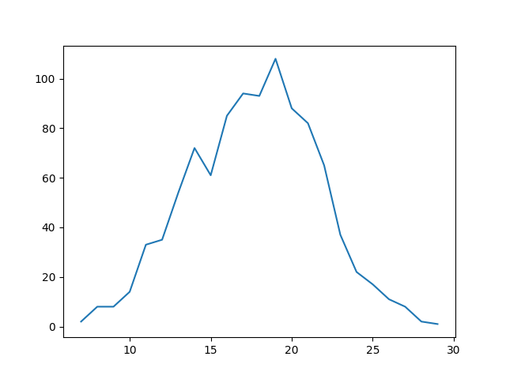
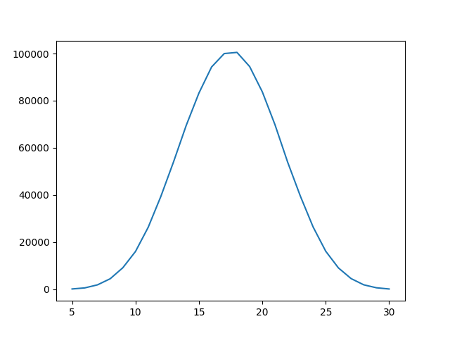

The central limit theory (CLT) states that when **independent** random variables are added, their properly normalized sum tends toward a normal distribution (a bell curve) even if the original variables themselves are not normally distributed. ~ Wikipedia

One constraint is that we must have finite variance, as that lowers the amount of outliers we see.

Let's roll a dice 1000 times and see what that gets us:

```{.python .numberLines}
from collections import Counter
import random

def r():
    return random.randrange(1, 7)


rolls = Counter()

for _ in range(1000):
    rolls[r()] += 1

sorted_dict = {k: rolls[k] for k in sorted(rolls)}
```

Running it I get this:

```{.sh .numberLines}
{1: 156, 2: 168, 3: 192, 4: 143, 5: 170, 6: 171}
```

- 1 was rolled 156 times
- 2 was rolled 168 times
- 3 was rolled 192 times
- 4 was rolled 143 times
- 5 was rolled 170 times
- 6 was rolled 171 times



You'll see that there's some variance, but we get a good enough result.

To test the central limit theorem, let's try to roll two dice at the same time 1000 times and plot it.

Change this line to this:

```{.python .numberLines}
for _ in range(1000):
    rolls[r() + r()] += 1
```

Here were the rolls:

```{.sh .numberLines}
{2: 22, 3: 59, 4: 81, 5: 110, 6: 149, 7: 174, 8: 144, 9: 101, 10: 77, 11: 53, 12: 30}
```

And here's the distribution:



You'll notice it's starting to converge on 6 and 7, but 2 and 12 were fairly unlikely.

We're starting to get a normal distribution!

Let's do 5 dice rolls.

Change the line below:

```{.python .numberLines}
for _ in range(1000):
    rolls[r() + r() + r() + r() + r()] += 1
```

Here's the outcome:

```{.sh .numberLines}
{7: 2, 8: 8, 9: 8, 10: 14, 11: 33, 12: 35, 13: 54, 14: 72, 15: 61, 16: 85, 17: 94, 18: 93, 19: 108, 20: 88, 21: 82, 22: 65, 23: 37, 24: 22, 25: 17, 26: 11, 27: 8, 28: 2, 29: 1}
```

And the five dice rolls.



We get closer to a normal distribution.

Let's do it a million times:

```{.python .numberLines}
for _ in range(1000000):
    rolls[r() + r() + r() + r() + r()] += 1
```

Here's the outcome:

```{.sh .numberLines}
{5: 147, 6: 600, 7: 1890, 8: 4469, 9: 9147, 10: 16052, 11: 26310, 12: 39423, 13: 54070, 14: 69536, 15: 83228, 16: 94310, 17: 99997, 18: 100488, 19: 94484, 20: 83745, 21: 69777, 22: 53880, 23: 39506, 24: 26489, 25: 16144, 26: 9076, 27: 4547, 28: 1900, 29: 649, 30: 136}
```

And hey look, that looks like a normal distribution to me!


